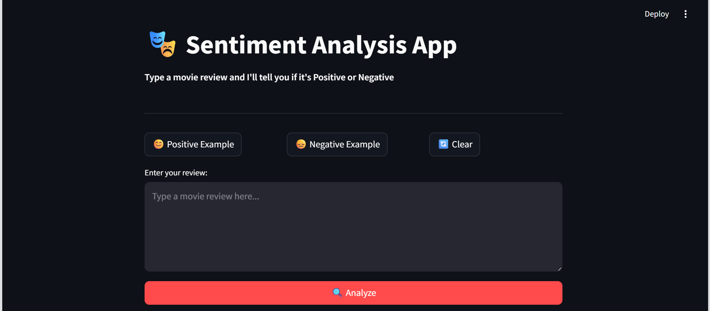
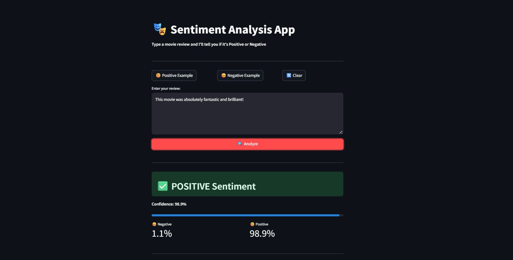
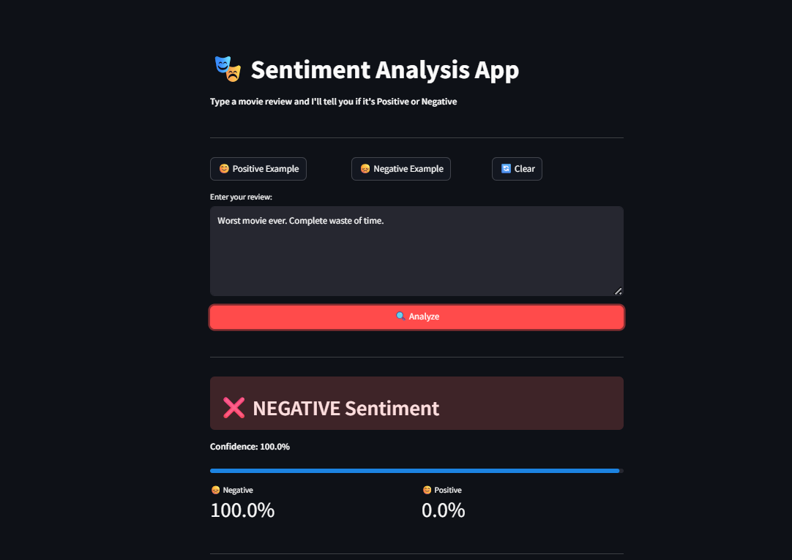

# 🎭 Sentiment Analysis Web App

A machine learning web app that detects whether a movie review 
is Positive or Negative using NLP and Logistic Regression.

## 🔗 Live Demo
👉 Coming soon

## 📸 Screenshots

## 🛠 Tech Stack
- Python 3.x
- Scikit-learn (Logistic Regression, TF-IDF)
- NLTK (text preprocessing)
- Streamlit (web app)
- Dataset: IMDB 50K Movie Reviews

## 📊 Model Performance
- Accuracy: ~89% on 10,000 test samples
- Task: Binary classification (Positive / Negative)

## 🚀 How to Run
git clone https://github.com/asnam-ds/sentiment-analysis-app
cd sentiment-analysis-app
pip install -r requirements.txt
python src/train_model.py
streamlit run app.py

## 💡 Skills Demonstrated
- NLP text preprocessing
- TF-IDF feature engineering
- Machine Learning classification
- Streamlit web deployment
- Python best practices

## 👤 Author
Asnam | MSc Applied Data Science
